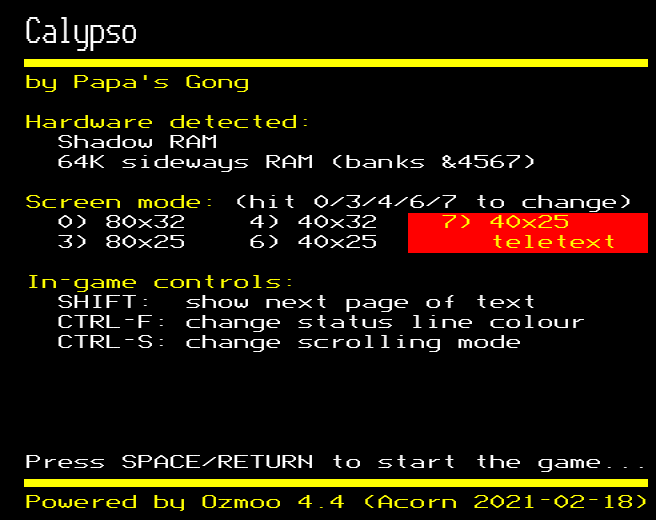
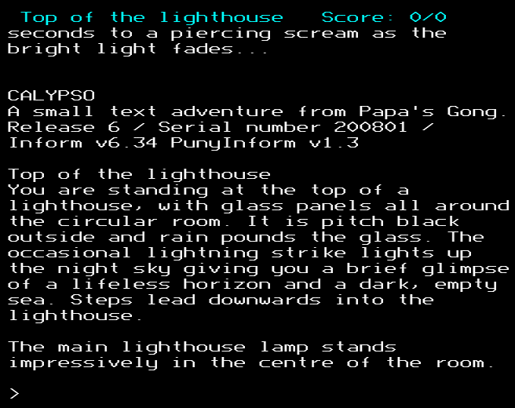

# What's this?

[Ozmoo](https://github.com/johanberntsson/ozmoo) is a Z-machine interpreter for the Commodore 64 and similar computers by Johan Berntsson and Fredrik Ramsberg.

Ozmoo for Acorn is a port for the 8-bit Acorn computers. It converts a Z-code game file into a bootable disc image which plays the game on a BBC B, B+ or Master or Acorn Electron.

As an example of what the result looks like, you can try Dave Footitt's [Calypso](https://ifdb.org/viewgame?id=apo771qxl1ba4lsy) running under Ozmoo in your web browser at [bbcmicro.co.uk](http://bbcmicro.co.uk/game.php?id=2575).




# Building a game using Acorn Ozmoo

The code is in my [github repository](https://github.com/ZornsLemma/ozmoo). The current stable release is "11.39 (2023-01-15)", which you can download [here](https://github.com/ZornsLemma/ozmoo/releases/tag/acorn-11.39-2023-01-15). The previous stable release was "4.4 (Acorn 2021-02-18)", which you can download [here](https://github.com/ZornsLemma/ozmoo/releases/tag/acorn-4.4-2021-02-18).

Building a game with Acorn Ozmoo isn't that difficult, but you do need to be able to use the command line to do it. (*Playing* a game generated with Acorn Ozmoo just involves booting a disc, as you can see from the Calypso example mentioned above.)

You need a modern computer to build the game on. I develop Acorn Ozmoo using Linux, but other people have used it on Windows and Mac.

You'll need some other software installed on your computer:
* [Python 2 or 3](https://www.python.org/downloads/)
* the [acme cross-assembler](https://sourceforge.net/projects/acme-crossass/) version 0.97 or later
* [basictool](https://github.com/ZornsLemma/basictool) version 0.06 or later, *or* the [beebasm assembler](https://github.com/stardot/beebasm/) version 1.09 or later
* the [lzsa compressor](https://github.com/emmanuel-marty/lzsa)

If you're using Windows, Ken Lowe's post on stardot [here](https://stardot.org.uk/forums/viewtopic.php?p=283858#p283858) includes some pre-built versions of acme, beebasm and lzsa and instructions on how to install them.

Given all that, to convert a Z-code game file into a bootable disc image:
* Unzip the Acorn Ozmoo release.
* Open a command line/terminal window and change into the directory you unzipped the release into.
* Execute the command
  ```
  python make-acorn.py -v my-game-file.z5
  ```
  replacing my-game-file.z5 with the name of your game file, of course.

If all goes well, you should end up with a file called my-game-file.ssd or my-game-file.dsd which is a bootable Acorn DFS disc image.

# Getting help

The best place to ask for help with Acorn Ozmoo is in [this thread](https://stardot.org.uk/forums/viewtopic.php?f=2&t=19975) on stardot.org.uk. I keep an eye on it and there are several other regular contributors. Alpha and beta releases are also posted there if you want to experiment with new features and bugs.
